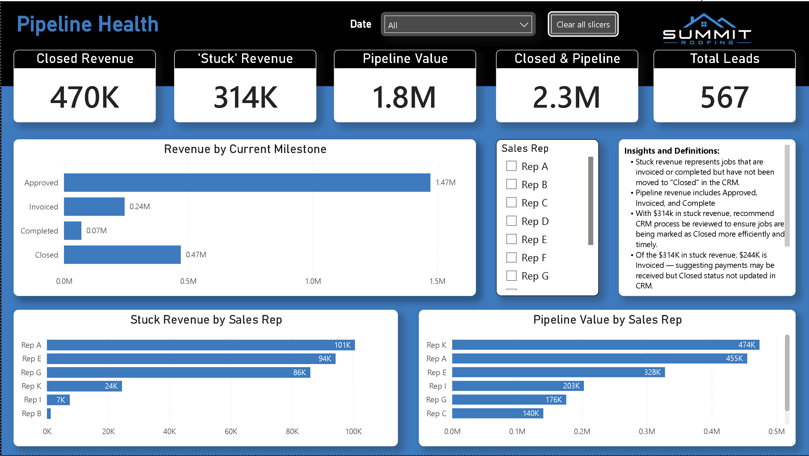
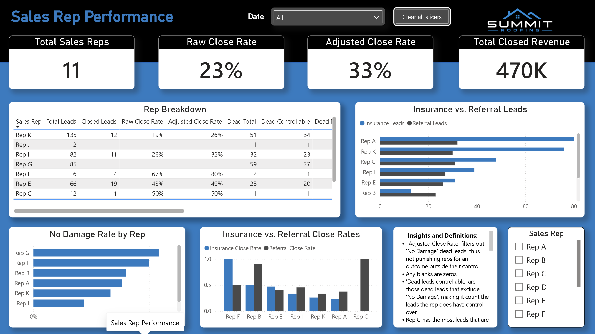
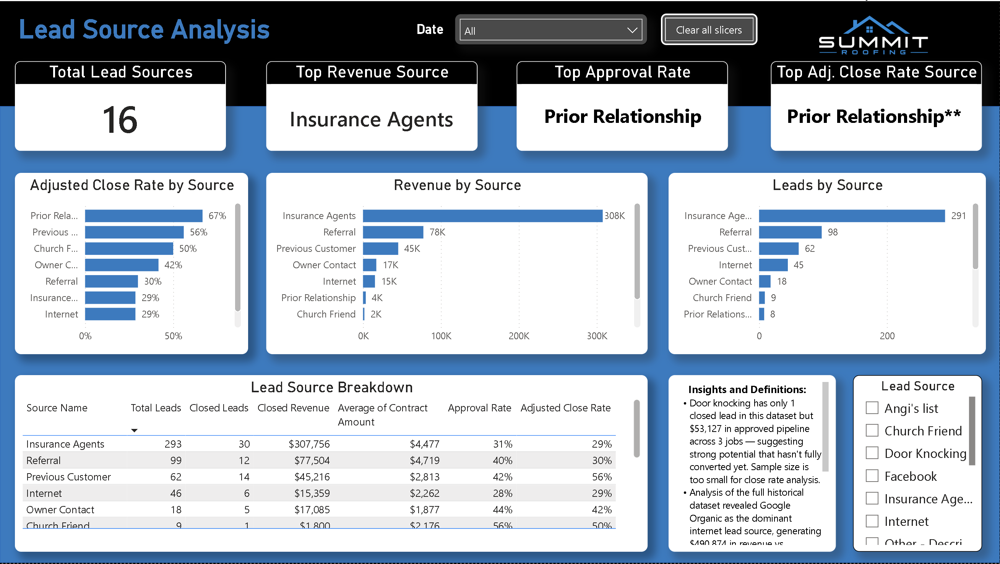
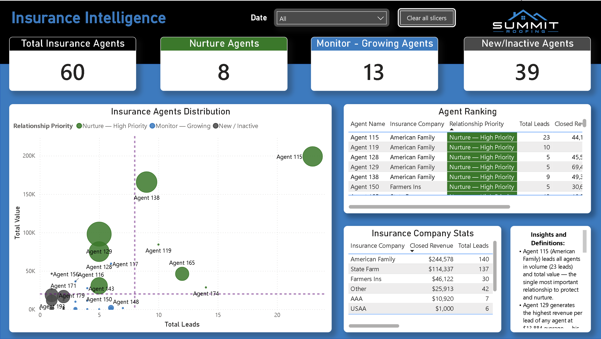

# Roofing CRM Analytics — SQL Server + Power BI

End-to-end analytics solution built for a regional roofing contractor. Transformed raw CRM exports into a normalized SQL Server database and delivered actionable business insights through Power BI dashboards.

---

## Key Findings

- **$313,906** in completed revenue not reflected in reporting — identified a CRM process gap where finished jobs were not being marked Closed
- **Insurance agent relationship scoring model** — prioritized 8 of 60 agents for immediate relationship investment using a custom scoring algorithm
- **Adjusted close rate methodology** — developed a fair rep performance metric excluding "No Damage" outcomes outside the rep's control
- **Challenged stakeholder assumption** — data revealed an allegedly underperforming rep had $175,865 in nearly-complete pipeline, not a performance issue

---

## Dashboards

### Pipeline Health

Surfaces $313K in completed work not marked Closed in CRM. Breaks down stuck revenue by rep and shows full pipeline value by milestone.

### Sales Rep Performance

Raw vs adjusted close rates per rep. Insurance vs referral close rate split. No Damage rate highlights uncontrollable outcomes by rep.

### Lead Source Analysis

Revenue, approval rate, and adjusted close rate by lead source. Addresses owner pain point: where do new sales reps get leads?

### Insurance Intelligence

Insurance company rankings and agent relationship priority scoring. Scatter plot maps all 60 agents by volume vs total value. Answers: which agents should I prioritize and which reps perform best with which insurers?

---

## Technical Stack

| Tool | Purpose |
|------|---------|
| Microsoft SQL Server | Database design, ETL, analytical views |
| T-SQL | Schema, data loading, analysis queries |
| Power BI Desktop | DAX measures, dashboard development |
| Excel | Data profiling and audit workbook |

---

## Database Schema

8 normalized tables across dimension and fact layers:

**Dimension tables:** `sales_reps`, `insurance_companies`, `insurance_agents`, `lead_sources`, `sub_lead_sources`

**Fact tables:** `leads`, `pipeline_timing`, `payments`

**Analytical views (6):** `vw_referral_chain`, `vw_insurance_origin_leads`, `vw_rep_close_rates`, `vw_insurance_company_ranking`, `vw_insurance_agent_ranking`, `vw_agent_relationship_priority`

---

## Repository Structure

```
roofing-crm-analytics/
├── README.md
├── sql/
│   ├── 01_schema.sql        # Tables, indexes, views
│   ├── 02_etl.sql           # Data loading and cleanup
│   └── 03_analysis.sql      # Business intelligence queries
├── powerbi/
│   └── summit_roofing_dashboard.pbix
└── screenshots/
    ├── 01_pipeline_health.png
    ├── 02_rep_performance.png
    ├── 03_lead_source_analysis.png
    └── 04_insurance_intelligence.png
```

---

## Skills Demonstrated

- Relational database schema design and normalization
- ETL pipeline development with data quality handling
- Data audit and profiling (null analysis, duplicate detection, constraint validation)
- Recursive CTEs for referral chain analysis
- Window functions: DENSE_RANK, ROW_NUMBER, PARTITION BY
- Conditional aggregation: CASE WHEN inside SUM/COUNT/AVG
- DAX measure development in Power BI
- Dashboard design and business storytelling
- Stakeholder communication and insight framing

---

## Data Notes

Data anonymized for portfolio use. Customer names replaced with generic identifiers, sales rep names replaced with Rep A–K, insurance agent names replaced with Agent IDs. Insurance company names retained (public entities). Original analysis performed on real CRM data from a regional roofing contractor with permission.

---

## Setup Instructions

1. Create a SQL Server database: `CREATE DATABASE roofing_crm;`
2. Run `sql/01_schema.sql` to create tables and views
3. Import source CSV files into staging tables via SSMS Import Flat File wizard
4. Run `sql/02_etl.sql` to load normalized tables
5. Connect Power BI Desktop to `roofing_crm` and open the `.pbix` file
